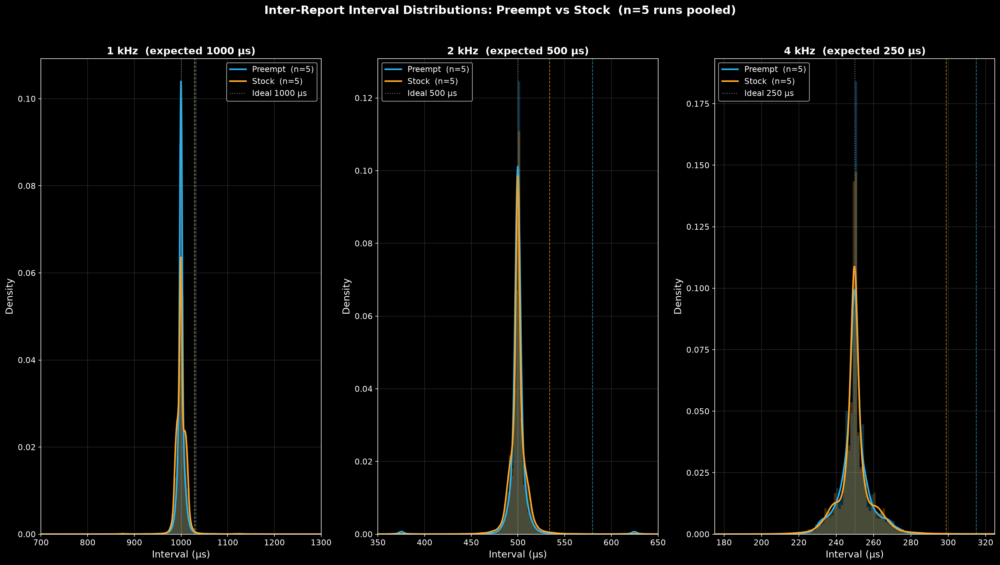
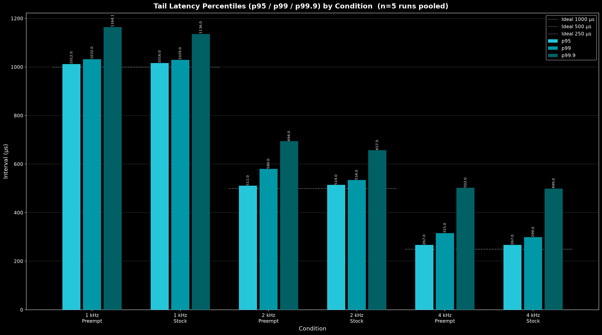
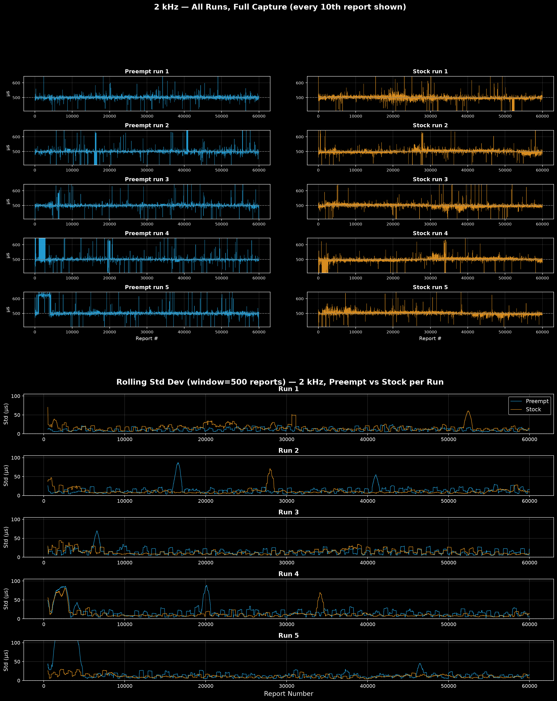
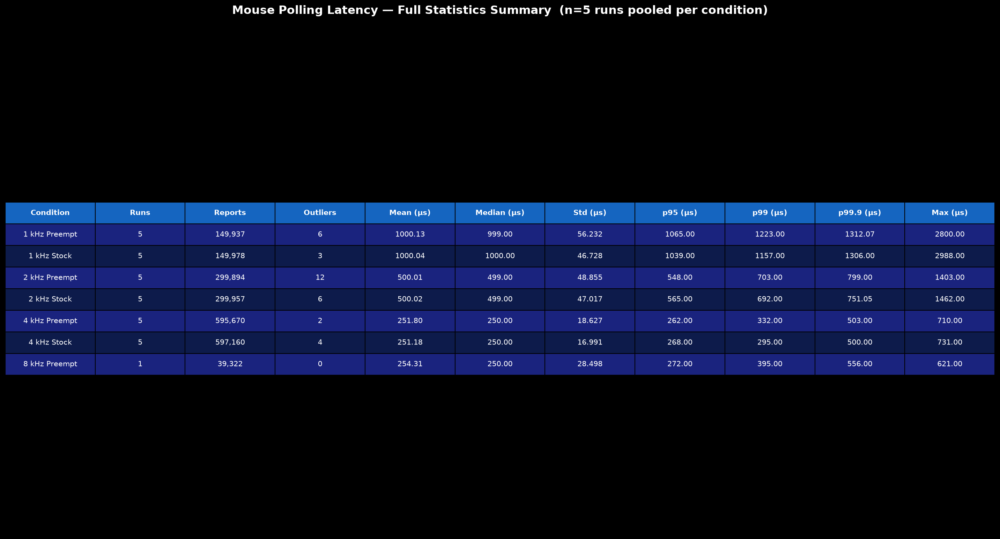

# Mouse Polling Latency: Measuring Host-Side Scheduling Jitter Under WSL2

**Result:** at 2kHz, a fully preemptible Linux kernel cuts the standard deviation of mouse report spacing by 37 percent (18.9µs to 12.0µs) compared to a stock kernel.

## The Question

A high polling rate mouse is supposed to report every # of microseconds, though that is almost never the case. This project is about where that timing inconsistency comes from, and how much of it the operating system is responsible for.

There are two places the timing can be affected.

**Device-side timing.** The sensor takes its readings on one clock and the USB controller sends reports on another. When those two drift out of sync, reports still leave at the right average rate, but the spacing between them differs. This happens entirely in the firmware, and is what companies spend resources trying to perfect their implementation.

**Host-side timing.** Even when the mouse sends a perfectly spaced report, the operating system does not always process it right away. If the CPU is busy running something else inside the kernel, the report has to wait until the kernel reaches a point where it is allowed to stop and handle it. On a stock kernel background processes can take priority, resulting in jitters.

This project isolates and measures Host-side timing. Does running a fully preemptible Linux kernel decrease the variance in the spacing between mouse reports, and at which polling rates does it matter?

The deeper version of this problem is the subject of recent research out of Northwestern's CS department on Dispersed Interrupt Polling, which proposes removing hardware interrupts entirely and replacing them with compiler-injected polls spread through the kernel and user code, eliminating the nondeterminism of interrupt handling at its source (NU-CS-2025-36). I was attempting to follow that work while building this. This project takes a smaller, more accessible angle on the same underlying question of interrupt-servicing determinism.

## Hardware and Setup

Testing ran on an **Endgame Gear OP1 8K v2** (Nuvoton M483 MCU, PAW3950 sensor) polled at 1kHz, 2kHz, and 4kHz, passed into WSL2 (Ubuntu) from Windows using usbipd-win.

The Windows host was kept clean to reduce noise. A fresh install of Windows 11 (AtlasOS) on its own drive, with VS Code, WSL, and the Brave browser installed was used. This was used as part of the control.

Reports were captured through the kernel's **evdev** interface rather than recording raw USB traffic. With evdev the kernel stamps each report with a timestamp the moment it enters the input subsystem, before any of the Python code runs. The script's own speed therefore cannot distort the spacing between reports. Timestamps use `CLOCK_MONOTONIC` (set via the `EVIOCSCLOCKID` ioctl) so they are immune to wall-clock adjustments.

## The Experiment

Two kernel conditions, three polling rates each, six paired captures in total.

| Condition | Kernel | Preemption |
|---|---|---|
| Preempt | 6.6.123.2-microsoft-standard-WSL2+ (custom build) | `CONFIG_PREEMPT=y` (full) |
| Stock | 6.18.33.1-microsoft-standard-WSL2 | `CONFIG_PREEMPT_NONE=y` |

Each capture ran 30 seconds of continuous slow circular motion, which guarantees a steady stream of reports with no idle gaps, and required zero `SYN_DROPPED` events. Any capture that dropped an event was thrown out and re-run. A separate 10-second capture at the 8kHz setting under the preemptible kernel is included for reference only (see Limitations).

## Results

### Distributions



At 1kHz the two kernels are nearly identical. Both distributions sit in a narrow, symmetric peak right at 1000µs. At 2kHz the difference becomes visible: the stock kernel's curve is wider and carries more weight in the shoulders on either side of the peak, while the preemptible kernel's peak is taller and narrower, meaning more of its reports land close to the ideal 500µs.

At 4kHz both kernels still peak tightly at 250µs and the two curves look very similar. The issue is that the usbipd passthrough layer has a throughput ceiling sitting right around 4kHz (documented in Limitations). At that point the virtualization layer becomes its own source of timing noise, and it largely masks the clean scheduler effect that was visible at 2kHz. The doubled intervals caused by this ceiling are too rare to show up as a visible bump in the distribution. They surface instead in the tail percentiles below.

### Tail percentiles



| Condition | Std (µs) | p99 (µs) | p99.9 (µs) | Max (µs) |
|---|---|---|---|---|
| 1kHz Preempt | 26.8 | 1028 | 1215 | 2018 |
| 1kHz Stock | 23.0 | 1027 | 1178 | 2440 |
| 2kHz Preempt | 12.0 | 524 | 629 | 779 |
| 2kHz Stock | 18.9 | 536 | 690 | 1462 |
| 4kHz Preempt | 29.2 | 488 | 510 | 689 |
| 4kHz Stock | 25.2 | 375 | 513 | 731 |

At 2kHz the preemptible kernel cuts the standard deviation of the interval by 37 percent, from 18.9µs down to 12.0µs, and lowers the p99.9 (the spacing exceeded by only one report in a thousand) by about 9 percent. Across every metric at 2kHz, preempt is the tighter and more consistent kernel.

4kHz is more mixed, and this is where the usbipd ceiling shows up as an issue. This is a known artifact of the passthrough layer rather than the kernel. When a report misses its scheduled slot, it is not lost, it is simply queued and sent in the next available slot alongside the report that was already due. The result is a single skipped interval followed by one that measures close to double the expected spacing. At 4kHz both kernels produce them, and they are what push the upper percentiles well above 250µs.

The differences between the two kernels at 4kHz are small and do not cleanly favor either one. Preempt has a higher p99 (488µs versus 375µs), but by the extreme tail both converge to almost the same value (p99.9 of 510µs versus 513µs, and a max of 689µs versus 731µs). That pattern is what you expect when the kernel is no longer the limiting factor.

### Time-series



This plots interval against report number for a 2000-report window taken from the middle of the 2kHz capture, reports 29,000 to 30,999,  past any startup artifacts.

Both kernels hold close to the 500µs line for almost the entire window. The difference is in the spikes. The stock kernel produces more of them and they reach further in both directions, including one outlier near report 30,600 where a single interval jumps past 1400µs. The preemptible kernel has spikes too, but they are fewer and smaller, mostly staying under 700µs.

This matches the standard deviation numbers above. The stock kernel is not jittery all the time, it spends most of the window tracking the target interval just as well as the preemptible kernel does. The difference shows up in occasional moments where something else takes the CPU for long enough to delay a report, and those moments are both more frequent and more severe under the stock kernel.

### The 1kHz case

At 1kHz, stock posts a slightly lower standard deviation than preempt (23.0µs versus 26.8µs). This is expected rather than contradictory. With 1000µs between reports, the kernel has roughly four times as much slack to service each one as it does at 4kHz, so scheduling delay is a small fraction of the interval no matter which kernel is running. What remains is mostly the minor fixed cost a preemptible kernel pays for checking more often whether it should reschedule. Preemption is viable once the interval gets short enough that scheduling delay is meaningful, which is what the 2kHz result shows.

### Full statistics



## Limitations

The 8kHz capture is included for reference only. The usbipd and vhci_hcd passthrough layer caps the observed rate at roughly 3,800 to 3,900Hz regardless of kernel, so it cannot isolate scheduler behavior the way the paired 1, 2, and 4kHz conditions do. This project also does not have access to PREEMPT_RT (the patch set does not apply cleanly to Microsoft's WSL2 kernel fork), to usbmon-level timing (evdev is measured at the input-subsystem boundary and misses processing inside the driver), or to the sensor firmware (the PAW3950 is under NDA). The full write-up is in [`docs/limitations.md`](docs/limitations.md).

## Repo Structure

```
mouse-polling-latency/
├── docs/
│   ├── methodology.md       formal experiment design: variables, controls, why evdev
│   ├── kernel-build.md      preemptible kernel build process
│   └── limitations.md       full limitations write-up
├── kernel/
│   ├── config.txt           preemptible kernel .config
│   └── build-notes.md       build log and notes
├── capture/
│   ├── capture_reports.py   evdev-based capture script
│   └── requirements.txt
├── data/
│   └── raw/                 captured CSVs plus per-capture metadata
├── analysis/
│   └── plot_intervals.py    generates every figure in this README
└── figures/                 generated figures
```

## Future Work

- Native Linux capture to remove the usbipd throughput ceiling and see true 8kHz behavior.
- A PREEMPT_RT kernel for a stronger preemption comparison.
- usbmon capture to measure timing inside the USB driver stack, not just at the input-subsystem boundary.
- An open-firmware dev board (nRF52840 + PMW3360 or similar) to measure device-side timing directly, the half of the problem this project does not touch.